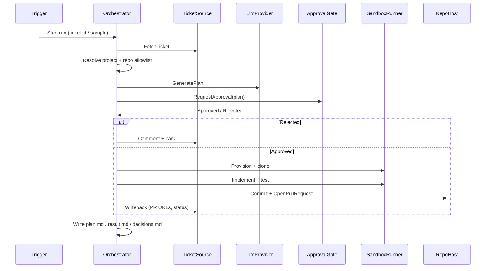

# AutoCoder architecture

## Goals

- Close the loop: **ticket → approved plan → code → PR → ticket update**
- Self-hosted, Docker Compose friendly
- Human-in-the-loop **before** code changes
- Pluggable trackers, hosts, models, and sandboxes
- No auto-merge in v1

## Components

| Component | Interface | Responsibility |
|-----------|-----------|----------------|
| Ticket source | `ITicketSource` | Fetch ticket, comments, transitions, writeback |
| Repo host | `IRepoHost` | Clone/branch, push, open PR (never merge in v1) |
| LLM provider | `ILlmProvider` | Chat/completions for plan + coding agents |
| Sandbox | `ISandboxRunner` | Isolated toolchain; run commands; no blind shell from ticket text |
| Pipeline | `IPipeline` | Ordered steps sharing `PipelineContext` |
| Approval | `IApprovalGate` | Block until human ratifies the plan |
| Orchestrator | `PipelineRunner` | Execute pipeline, persist run artifacts |

## Sequence (coding run)

## Data flow

1. **Ingress** — CLI dry-run, later webhook/poll. Claim lease so one ticket has at most one live run.
2. **Context** — Ticket body + project config (agent, tracker, allowed repos) → `PipelineContext`.
3. **Plan** — Structured plan (summary, files, risks, test plan). Persisted to `runs/{id}/plan.md`.
4. **Gate** — Human must approve. Dry-run auto-approves with a clear banner so demos work offline.
5. **Execute** — Sandbox runs allowlisted commands only. Ticket text is never executed as shell.
6. **Land** — Branch + PR payload. Ticket comment with links. `result.md` includes outcome and (later) token/$ cost.

## Config vs secrets

| In YAML | In env / secret store |
|---------|----------------------|
| Agent/model names, project wiring, trigger statuses, repo URLs, allowlists | API keys, Jira/GitHub tokens, webhook HMAC secrets |
| Pipeline name (`fix-bug`) | DB/Redis connection strings (Phase 1+) |

See [config-example.yml](config-example.yml).

## Security posture

- Secrets only via env / `${VAR}` in config
- Repo allowlist per project — refuse unknown remotes
- Plan approval before mutations
- Sandbox: no privileged host mounts by default; command allowlist
- Staged-diff secret scan before commit (Phase 1)
- Never auto-merge

## What exists now vs later

| Now (Phase 0) | Later |
|---------------|--------|
| Interfaces + dry-run pipeline + **switchable Jira webhook server** | Real Jira API writeback / GitHub / LLM / Docker sandbox |
| Sample ticket JSON + sample webhook payload | Poll fallback + claim store |
| Local `runs/` artifacts | Redis/DB + dashboard |
| Compose stub with port 8081 | Hardened Compose stack |
